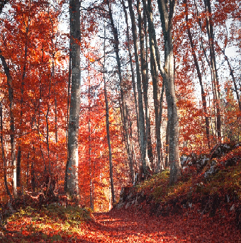

# assembly-programming

### Project Description

This project demonstrates averaging filter using RISC-V assembly language in the RARS simulator. The main goal of this project is to read, process, and save BMP images using assembly code, showcasing the capabilities of low-level programming in handling image processing tasks.

### Tools and Technologies

- **RARS**: RISC-V Assembler and Runtime Simulator
- **Assembly Language**: Low-level programming for RISC-V architecture
- **Java**: Required to run the RARS simulator

### How to Run the Project

1. **Install Java**: Ensure you have Java installed on your machine.

   ```sh
   java -version
   ```

2. **Download RARS**: Download the latest version of RARS from [RARS GitHub Repository](https://github.com/TheThirdOne/rars).

3. **Run RARS**:
   Run the command below in the downloaded rars directory in terminal:

   ```sh
   java -jar rars.jar
   ```

4. **Load the Assembly Code**:

   - Open RARS.
   - Load the provided assembly code file (`project.asm`) into the simulator.

5. **Assemble and Run**:
   - Click on `Run` -> `Assemble` (or press `F3`).
   - Click on `Run` -> `Go` (or press `F5`) to execute the program.

### Project Details

The assembly code performs the following tasks:

1. **Reading BMP Images**:

   - The `read_bmp` function reads the content of a BMP file into memory. It handles opening the file, reading the header, extracting image information, allocating memory for pixel data, and reading the image data.

2. **Saving BMP Images**:

   - The `save_bmp` function saves the processed BMP image data back to a file. It handles opening the file, writing the header, writing the image data, and closing the file.

3. **Pixel Manipulation**:

   - The `set_pixel` function sets the color of a specified pixel.
   - The `get_pixel` function retrieves the color of a specified pixel.

4. **Filtering and Processing**:
   - The `filter` function applies a 5x5 window filter to the image. It collects RGB values from the window, sorts them using `bubble_sort`, and computes the average color with `avg_color`.

### File Structure

- **main.asm**: The main assembly file containing the implementation of image reading, processing, and saving functions.
- **input_name**: Name of the input BMP file (`polana.bmp`).
- **output_name**: Name of the output BMP file (`wynik.bmp`).

### Example Usage

To run the program, place the `las.bmp` file in the appropriate directory, load the `main.asm` file into RARS, and execute the program. The processed image will be saved as `las_wynik.bmp`.

This project illustrates how low-level programming can be used to manipulate and process image data, providing an excellent example of the power and flexibility of assembly language.

### Example Images

**Before Applying Filter:**



**After Applying Filter:**


